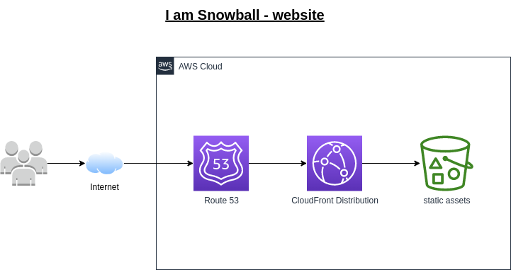

# snowball-landing
This repository contains the assets for hosting the `snowball-landing` website.

## Script for Uploading Objects to Amazon S3
This script allows you to upload objects (e.g., files, folders) to an Amazon S3 bucket using the AWS CLI. 

### Prerequisites
Before using this script, you must have the following:

* AWS CLI installed on your machine or EC2 instance
* AWS credentials configured on your machine or EC2 instance

## Usage
To use this script, follow these steps:

* Clone or download this repository to your local machine or EC2 instance.
* Open a terminal and navigate to the directory containing the `upload_to_s3.sh` script.
* Modify the PROFILE variable in the script to match your named profile for the `deflationcoins` AWS account.
* Make the script executable by running `chmod +x upload_to_s3.sh`.
* Run the script by typing `./upload_to_s3.sh` in the terminal.

The script will recursively upload all contents of the current directory to the specified S3 bucket.

## Hosting
The website is hosted as a static website on AWS S3 with CloudFlare distribution as a CDN.

## Automatic deployments
There is a Github Action configured to upload the contents of the repository to S3.

This will reflect the changes automatically on the website, which is hosted on AWS S3 with a CloudFront distribution for cache, and Route 53 for managing the DNS record.

## Status Page
The website uptime monitor is hosted using `Github Pages` In the [Deflation Coins Upptime](https://github.com/DeflationCoins/upptime) repository.

Check out the [Live Status](https://deflationcoins.github.io/upptime)

## Troubleshooting
If you encounter any issues with this script, here are some troubleshooting tips:

* Make sure that your AWS credentials are configured correctly on your machine or EC2 instance.
* Make sure that you have permissions to access the S3 bucket.
